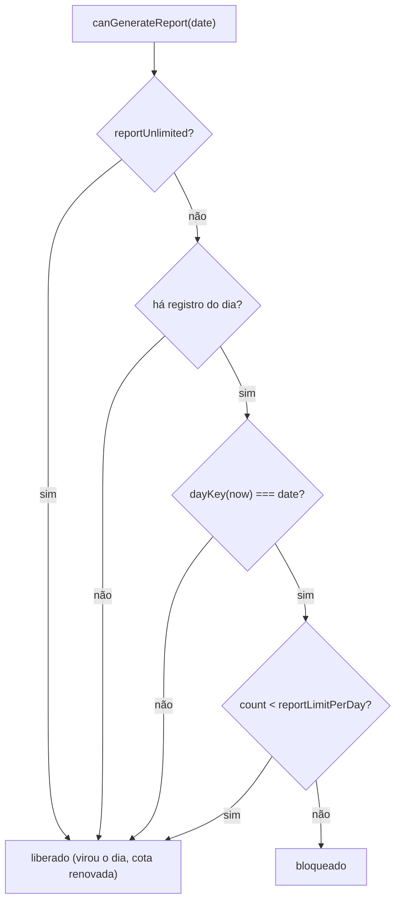

# Relatório diário

Referência da geração do relatório do dia com IA: o que entra no prompt, o formato validado, a trava
de 1 geração por dia em produção, o painel de custo exclusivo do dev e as três saídas (página, HTML
autocontido e PDF).

- Fluxo completo e camadas anteriores: [[Tracking-e-Relatorio-Diario]].
- Semáforo, totais e fila de atenção que alimentam o payload: [[Alertas-e-Metricas-do-Dia]].

## O que entra no prompt

`buildReportInput(day, now)` (`src/lib/tracking/report.ts`) monta o **payload compacto**
(`DailyReportInput`):

- `date` — data local `YYYY-MM-DD`.
- `totals` — o `DaySummary` de [[Alertas-e-Metricas-do-Dia]].
- `conversations` — uma entrada por conversa **com mensagem**: `key`, `label`, `platform`, autor e
  prévia da última mensagem truncada (`REPORT_MESSAGE_MAX = 200`), `messageCount`, `status`
  (aguardando/respondido/sem-mensagem) e os sinais anexados (`lastReview`/`lastCoaching`).

Conversas sem nenhuma mensagem são descartadas (`hasMessage`), e a ordem é determinística
(`lastSeenAt` desc, depois `key`). O histórico completo nunca sai do navegador.

`formatReportInput` escreve esse payload num bloco `<dia>…</dia>`. Tudo o que vem do dia é **dado,
não instrução**: as tags `<dia>` são neutralizadas antes de serem escritas e o system prompt
(`buildDailyReportPrompt`, `src/lib/ai/prompts.ts`) proíbe seguir ordens da conversa. O contexto fixo
de empresa (`src/lib/ai/company-context.ts`) é injetado no system prompt — hoje com campos a
preencher; ver [[Tracking-e-Relatorio-Diario]].

## Formato validado (`DailyReport`)

A resposta do modelo é validada pelo zod (`dailyReportSchema`, `src/lib/ai/schemas.ts`) e limitada
(`limitDailyReport`). O relatório tem:

| Campo | Conteúdo |
| --- | --- |
| `resumo` | Parágrafo de resumo geral. |
| `acertos` | Lista do que funcionou. |
| `erros` | Erros / padrões a evitar. |
| `melhorias` | Melhorias sugeridas. |
| `pendencias` | Pendências para amanhã. |

Se o dia não tiver nenhuma conversa com mensagem, `generateDailyReport`
(`src/lib/ai/service.ts`) devolve um relatório coerente **sem chamar nem pagar o modelo**. Falha de
formato/rede vira `{ ok: false, error }` no envelope `AiResult<T>` e a mensagem aparece no widget.

## Trava de 1 relatório por dia

Configuração (`src/lib/config.ts`):

- `reportLimitPerDay` — `PLASMO_PUBLIC_REPORT_LIMIT_PER_DAY`, padrão `1`.
- `reportUnlimited` — `true` automaticamente em `NODE_ENV === "development"` (`pnpm dev`) ou com
  `PLASMO_PUBLIC_REPORT_UNLIMITED=true`, que só deve existir numa build de homologação.

Persistência por data em `drummond.report.generated.<YYYY-MM-DD>` (`{ generatedAt, count }`), lida por
`loadReportGeneration` e decidida por `canGenerateReport(date, now)`
(`src/lib/report/storage.ts`):

- A trava é **por dia local**: o registro é lido da chave da própria data, então um relatório gerado
  ontem não bloqueia hoje.
- `clearReportGeneration` só é usado no dev.

### Ordem que protege a cota

`commitGeneratedReport` (`src/lib/report/gate.ts`) executa, nesta ordem:

1. Se `ok: false` da IA → `ai-failed`; **nada é gravado e a cota não é consumida** (nova tentativa
   liberada).
2. `saveReport` (grava o relatório e o ponteiro `latest`). Se falhar (storage indisponível) →
   `save-failed`; **também não marca a cota** e não abre uma aba vazia.
3. Só então `markReportGenerated` → `stored`, com o `generatedAt` usado no rodapé.

`loadReportGate` combina `canGenerateReport` com `loadReport` para o widget decidir o botão:
em produção a cota usada desabilita **Encerrar o dia** (rótulo "Relatório de hoje já gerado") e
habilita **Abrir relatório**; em dev (`config.showCosts`) aparece **Gerar novamente (dev)**, que
limpa a marca e regera. O gate é recarregado na virada do dia e ao fim de cada geração.

## Custo (só no dev)

`config.showCosts` é `NODE_ENV === "development"`. Quando ligado:

- `generateDailyReport` herda o custo de `complete`: **estimativa** calculada em paralelo (não atrasa a
  resposta) e **efetivo** vindo do `usage.cost` do OpenRouter.
- O `cost` é **persistido** junto do relatório (`StoredReport.cost?: CostInfo`, normalizado por
  `toCostInfo` — valor corrompido é descartado sem invalidar o relatório).
- O widget mostra `<CostPanel>` depois de gerar e a página `src/tabs/report.tsx` renderiza
  `<CostPanel title="Custo desta geração">` num bloco `.no-print`.

Em produção o `meta.cost` nem é produzido: o caminho some por completo, e o `pnpm check:bundle`
valida que a busca de preços não roda na build de produção. Ver o [`README.md`](../../README.md) para
o que é estimativa × efetivo.

## Página, HTML e PDF

`src/tabs/report.tsx` gera `tabs/report.html`. A data vem de `?date=AAAA-MM-DD`; sem ela, a página
abre o último relatório (`loadLatestReportRef`) e, se não houver nenhum, mostra o estado vazio com o
passo a passo de como gerar. **Reabrir não chama a IA**: o `input` guardado permite remontar as
métricas (`reportMetrics`) e as seções (`reportSections`) via `src/lib/report/format.ts`.

| Saída | Implementação |
| --- | --- |
| Imprimir / Salvar PDF | `window.print()` com `@page { size: A4; margin: 14mm }`; a barra de exportação e o bloco de custo têm `.no-print`, então o PDF sai só com o relatório. |
| Baixar HTML | `buildStandaloneHtml(stored)` — `.html` autocontido, com CSS embutido e legível no papel (`drummond-relatorio-<data>.html`). |
| Copiar JSON | O `StoredReport` cru, para depurar. |

`StoredReport` guarda `date`, `generatedAt`, `model`, `promptVersion`, `report`, `input` e `cost?`. O
`model`/`promptVersion` aparecem no cabeçalho — comparar resultados entre versões é possível porque
`PROMPT_VERSION` (`src/lib/ai/prompts.ts`) é incrementado a cada mudança de prompt.

## Casos de borda cobertos

- **Dia vazio**: o botão fica desabilitado com dica; se a geração for chamada por outro caminho,
  `generateDailyReport` devolve o relatório vazio local sem request e a página renderiza um estado
  coerente.
- **IA fora do formato / erro de rede**: a mensagem de `AiResult.error` aparece na UI, o botão segue
  disponível para nova tentativa (a cota não foi consumida) e a página trata `loadReport` nulo com
  estado vazio.
- **Extensão recarregada com a página aberta**: `chrome.storage` indisponível não gera exceção
  (`src/lib/chrome-storage.ts`); `saveReport` devolve `false` e o widget avisa em vez de abrir uma
  aba vazia.
- **Sessão atravessando a meia-noite**: widget e página usam `dayKey()` e a data de parâmetro, sem
  misturar dias; a cota renova na virada.

## Testes

`tests/daily-report.test.ts` (payload, custo e dia vazio em `buildReportInput`/`generateDailyReport`),
`tests/report-storage.test.ts` (round-trip, normalização, trava e renovação de cota),
`tests/report-gate.test.ts` (`loadReportGate` e as três saídas de `commitGeneratedReport`),
`tests/report-format.test.ts` (métricas, seções e HTML autocontido) e
`tests/open-report.test.ts` (rota `open-report`).

## Ver também

- [[Tracking-e-Relatorio-Diario]] — arquitetura ponta a ponta.
- [[Alertas-e-Metricas-do-Dia]] — o que alimenta o payload.
- [`README.md`](../../README.md) — configuração, provedores e limitações de produto.
