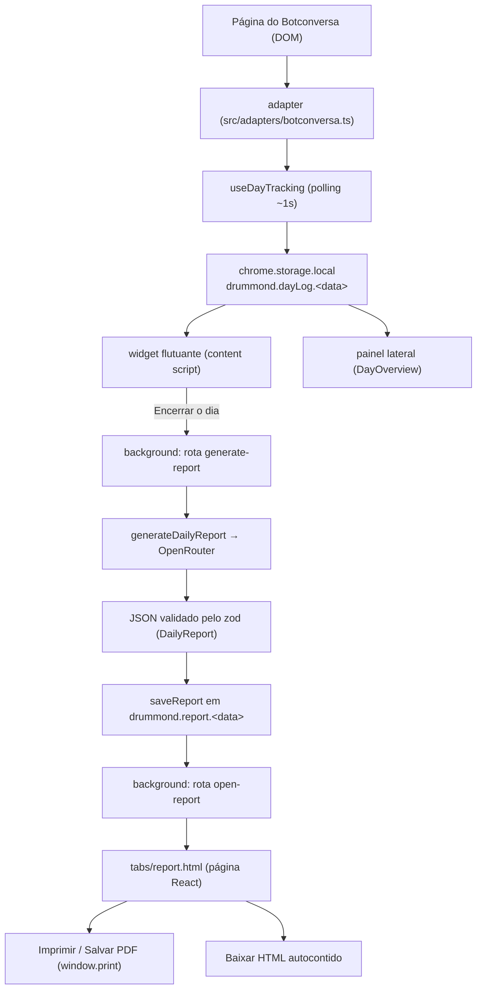

# Tracking local e relatório diário

Documento de referência da arquitetura construída nas Fases 01–05 do playbook de iniciação. Descreve
como o Drummond acompanha o dia de trabalho do vendedor no Botconversa **sem chamar a IA**, como mede
tempo de resposta, como gera o relatório diário com o modelo e como o transforma em um artefato
levado embora (página navegável, HTML autocontido e PDF).

- Visão de produto e limitações: [`README.md`](../../README.md).
- Regras do semáforo, totais e fila de atenção: [[Alertas-e-Metricas-do-Dia]].
- Geração com IA, trava de 1x/dia, custo e página/PDF: [[Relatorio-Diario]].

## Princípio central

O tracking é **local, passivo e barato**. A extensão observa o que a página do Botconversa já mostra,
guarda no `chrome.storage.local` e não faz nenhuma chamada de modelo. A IA só entra no fim do dia,
uma vez, a pedido do vendedor, sobre um **resumo compacto** do dia — nunca sobre o histórico completo
das conversas. Isso mantém o custo previsível (o alvo é ~15 vendedores usando diariamente) e permite
que widget e painel fiquem coerentes entre abas sem servidor.

## Fluxo ponta a ponta

Cada etapa é descrita abaixo, com o arquivo responsável.

## 1. Adapter — ler o DOM sem quebrar

`src/adapters/` isola todo seletor de DOM. Hoje só existe o `botconversaAdapter`, registrado em
`src/adapters/index.ts` e resolvido por hostname (`getAdapter(location.hostname)`). A interface
`ChatAdapter` (`src/adapters/types.ts`) expõe o mínimo: campo de digitação, rascunho,
`readConversation(limit)`, `getConversationKey()` e `writeDraft()`.

- O content script (`src/contents/companion.tsx`) roda num shadow DOM com `matches` restrito a
  `https://app.botconversa.com.br/*`.
- As classes do Botconversa são CSS Modules (`_chatInput_kvmgj_16`); o adapter casa só o prefixo
  estável (`_chatInput_`), então deploys comuns não quebram a extensão. Há uma fixture HTML em
  `tests/fixtures/` que congela o formato esperado.
- `readConversation` devolve `ChatMessage[]` com `author` normalizado em
  `cliente | vendedor | bot | sistema` e um `time` que é **apenas a string da tela** (ver limitações).

## 2. `useDayTracking` — observação e persistência

`src/hooks/useDayTracking.ts` conecta o adapter ao log do dia.

- **Polling leve (~1 s)** porque SPAs trocam de conversa sem avisar, mais `chrome.storage.onChanged`
  (`subscribeDay`) para refletir o que outra aba gravou.
- Cada tick lê a conversa aberta pelo adapter e alimenta o redutor **puro**
  `observeConversation` (`src/lib/tracking/store.ts`). O redutor não toca em `chrome` nem no relógio —
  recebe `now` — para ser testável sem navegador.
- `sameObservation` evita reescrever o dia a cada segundo: só grava quando algo relevante mudou.
- **Gravação com merge** (`saveDayMerged`): o dia inteiro é reescrito, então a gravação junta o log
  local com o que já estava no storage. Duas abas em conversas diferentes não se sobrescrevem.
- **Virada de dia** (`rolloverDate` / `dayKey` em `src/lib/tracking/level.ts`): às 00:00 o hook
  recomeça na nova data local sem tocar no dia anterior, que continua no storage e consultável pelo
  relatório.

Nenhuma chamada de IA nasce aqui.

## 3. `chrome.storage.local` — uma chave por dia

Todas as chaves são namespaced sob `drummond.` e lidas por data, nunca misturando dias:

| Chave | Conteúdo | Definida em |
| --- | --- | --- |
| `drummond.dayLog.<YYYY-MM-DD>` | `DayLog` do dia (conversas + totais + `updatedAt`) | `src/lib/tracking/constants.ts` |
| `drummond.widgetPosition` | posição/minimizado do widget, com `version` | `src/lib/tracking/constants.ts` |
| `drummond.report.<YYYY-MM-DD>` | `StoredReport` (relatório + `input` + modelo/prompt + `cost?`) | `src/lib/report/storage.ts` |
| `drummond.report.latest` | ponteiro `{ date, generatedAt }` do último relatório | `src/lib/report/storage.ts` |
| `drummond.report.generated.<YYYY-MM-DD>` | `{ generatedAt, count }` — trava diária | `src/lib/report/storage.ts` |
| `theme` | `"dark"` / `"light"` | `src/lib/theme.ts` |

Regras de robustez que valem para todo o storage:

- **Acesso defensivo centralizado** em `src/lib/chrome-storage.ts` (`localArea()` /
  `storageChanges()`, ambos com `try/catch`). Quando a extensão é recarregada com a página aberta, o
  content script perde o `chrome.storage`; ler sem guarda lançaria exceção síncrona dentro de um
  efeito React. Quem chama trata `null` como "sem storage" e segue em memória.
- **Normalização na leitura**: `toDayLog`, `toStoredReport`, `toReportGeneration`, `toReportRef` e
  `toWidgetPosition` fazem todo dado vindo do storage passar por um validador. Registro corrompido
  vira dia vazio / `null`, e a UI mostra o estado vazio em vez de quebrar.
- **Escrita silenciosa**: `saveDay`, `saveDayMerged`, `saveReport`, `markReportGenerated` e
  `saveWidgetPosition` engolem a falha quando não há storage. `saveReport` é a exceção que devolve
  `boolean`, porque quem chama precisa saber se o relatório foi realmente persistido.

## 4. Widget e painel — as duas UIs do dia

- **Widget flutuante** (`src/components/DayWidget.tsx`, injetado pelo content script): lista as
  conversas acompanhadas, com chip de tempo de espera, badge de alerta e totais do dia. É arrastável
  e lembra posição/minimizado. É também onde vive o botão **Encerrar o dia**.
- **Painel lateral** (`src/components/DayOverview.tsx`, em `src/sidepanel.tsx`): os mesmos totais e a
  mesma fila de atenção, lidos do storage **sem adapter** (o painel só lê o que o content script
  gravou). As duas UIs ficam coerentes por construção, sem duplicar a regra do semáforo.
- Revisão e coaching **não geram chamadas novas** para alimentar o dia: `recordReview` /
  `recordCoaching` apenas anexam a resposta que a extensão já produziu (`reviewSignal` /
  `coachingSignal` em `src/lib/tracking/signals.ts`).

## 5. Geração do relatório — `generate-report`

A IA só é chamada no background, a partir do widget. O content script nunca chama o modelo.

1. `buildReportInput(day, now)` (`src/lib/tracking/report.ts`) monta o payload compacto: totais do
   dia + uma linha por conversa com a **última mensagem truncada** (`REPORT_MESSAGE_MAX = 200`),
   estado, espera e sinais. Conversas sem nenhuma mensagem são descartadas.
2. O widget manda para a rota `generate-report` (`src/background/messages/generate-report.ts`) via
   `sendToBackground`. O nome do arquivo registra a rota para o `@plasmohq/messaging`; não há
   registro manual.
3. `generateDailyReport` (`src/lib/ai/service.ts`) monta o prompt `<dia>…</dia>`
   (`buildDailyReportPrompt`), chama o OpenRouter e valida a saída com o zod
   (`dailyReportSchema`). Se o dia não tiver conversas com mensagem, devolve um relatório coerente
   **sem chamar o modelo**.
4. O resultado atravessa o messaging no envelope serializável `AiResult<T>` (`{ ok, data|error, meta }`).
   Texto do dia é dado, não instrução: `formatReportInput` neutraliza tags `<dia>` vindas do tracking
   e o system prompt proíbe seguir ordens da conversa.
5. `commitGeneratedReport` (`src/lib/report/gate.ts`) grava o `StoredReport` (`saveReport`) e **só
   então** marca a cota do dia (`markReportGenerated`). A ordem garante o invariante: falha da IA ou
   do storage **não** consome a geração do dia.
6. A rota `open-report` (`src/background/messages/open-report.ts`) abre
   `tabs/report.html?date=<data>` pelo background — `chrome.tabs` não existe no content script.

Detalhes de prompt, formato da resposta e provedores ficam no [`README.md`](../../README.md); o
formato exato do relatório, a trava e o custo estão em [[Relatorio-Diario]].

## 6. Página e exportação — tab HTML

`src/tabs/report.tsx` gera `tabs/report.html`. A página lê o `StoredReport` do storage (por
`?date=AAAA-MM-DD` ou pelo ponteiro `latest` via `loadLatestReportRef`) e renderiza resumo, seções e
métricas. **Não há nova chamada de IA para reabrir** — o `input` guardado com o relatório permite
remontar `summarizeDay` e as médias.

Três saídas para o mesmo conteúdo, em `src/lib/report/format.ts`:

- **Imprimir / Salvar PDF**: `window.print()` com layout A4 (`@page`) e a barra de exportação marcada
  com `.no-print`, então o PDF sai só com o relatório.
- **Baixar HTML**: `buildStandaloneHtml(stored)` produz um `.html` autocontido e legível no papel.
- **Copiar JSON**: o `StoredReport` cru, útil para depurar.

## Decisões de arquitetura

| Decisão | Por quê |
| --- | --- |
| IA só no background | A chave do OpenRouter fica fora do content script/painel; o modelo nunca é chamado da página. |
| Payload compacto (última mensagem truncada) | O relatório roda 1x/dia sobre o resumo; o histórico completo nunca sai do navegador e o prompt fica barato. |
| Uma chave de storage por dia | Evita misturar relatórios de dias diferentes e permite reabrir dias passados sem `join`. |
| Redutores puros com `now` injetado | `store`/`summary`/`level`/`report` são testáveis sem navegador nem relógio global. |
| Leitura sempre normalizada | Extensão recarregada, dia gravado por versão antiga ou registro corrompido não quebram a tela. |
| Merge entre abas na gravação | Duas abas em conversas diferentes não se sobrescrevem. |
| Gravar o relatório antes de marcar a cota | Falha da IA/storage não consome a única geração do dia. |
| `dayKey` com data local, não UTC | No Brasil (UTC-3) o `toISOString()` jogaria a noite inteira no dia seguinte. |
| Trava 1x/dia em produção, livre no dev | Protege contra gasto descontrolado sem atrapalhar os testes (`reportUnlimited` em `NODE_ENV=development`). |

## Limitações conhecidas

- **Só conversas abertas**: o tracking registra a conversa que o vendedor abriu. Conversas que ele
  nunca abriu no dia não entram — não há varredura da lista inteira.
- **`time` sem data**: o adaptador lê o horário da tela como string (ex.: `"Hoje 10:32"`, às vezes com
  o dia escrito). Não dá para reconstruir o instante da mensagem, então a espera é ancorada em
  `clientSince` — o momento em que a extensão **observou** a mensagem do cliente. Se a extensão não
  estava com a aba aberta, a espera começa a contar do primeiro tick que a viu, não do envio real.
- **Só as mensagens carregadas na tela**: para incluir mensagens antigas, o vendedor precisa rolar a
  conversa para cima.
- **Bot x humano**: o DOM do Botconversa não distingue mensagem de humano e de bot; templates vão como
  `VENDEDOR (modelo)` e eventos como `SISTEMA`.
- **1 geração por dia em produção** (`config.reportLimitPerDay = 1`, `config.reportUnlimited` falso).
  É o custo previsto do recurso; em dev a trava fica livre.
- **Sem backend**: tudo vive no `chrome.storage.local` daquele navegador. Não há sincronização entre
  máquinas nem visão de equipe.

## Como melhorar a precisão do relatório

O relatório herda o contexto fixo de `src/lib/ai/company-context.ts`, injetado no system prompt em
toda requisição. Hoje ele está com os campos em branco (`COMPANY_CONTEXT` diz "preencher"). **Quando
o time quiser sugestões e análises mais específicas**, preencha ali:

- Segmento/produtos: o que a empresa vende e para quem.
- Diferenciais que os vendedores costumam destacar.
- Políticas comerciais que a IA deve respeitar (já há a regra fixa de nunca propor/altera valores).
- Termos a evitar (ex.: "promoção imperdível", "última chance", promessas de resultado).

O texto vai **em toda requisição ao modelo** e fica embutido na extensão: não coloque dados sensíveis.
Ao mexer no prompt, incremente `PROMPT_VERSION` (`src/lib/ai/prompts.ts`) — ele aparece no rodapé do
relatório e ajuda a comparar resultados entre versões.

## Mapa de arquivos

| Camada | Arquivos |
| --- | --- |
| Adapters | `src/adapters/types.ts`, `src/adapters/index.ts`, `src/adapters/botconversa.ts`, `src/adapters/dom.ts` |
| Tracking (puro) | `src/lib/tracking/level.ts`, `summary.ts`, `signals.ts`, `format.ts`, `report.ts`, `types.ts`, `constants.ts` |
| Tracking (persistência) | `src/lib/tracking/store.ts`, `src/lib/chrome-storage.ts`, `src/hooks/useDayTracking.ts` |
| UI do dia | `src/components/DayWidget.tsx`, `src/components/DayOverview.tsx`, `src/contents/companion.tsx`, `src/sidepanel.tsx` |
| Relatório | `src/lib/report/storage.ts`, `gate.ts`, `format.ts`, `src/tabs/report.tsx` |
| IA | `src/lib/ai/service.ts`, `prompts.ts`, `schemas.ts`, `cost.ts`, `company-context.ts` |
| Rotas do background | `src/background/messages/generate-report.ts`, `open-report.ts`, `src/lib/messages.ts` |
| Testes | `tests/tracking.test.ts`, `tracking-storage.test.ts`, `tracking-summary.test.ts`, `report-storage.test.ts`, `report-gate.test.ts`, `daily-report.test.ts`, `report-format.test.ts`, `chrome-storage.test.ts`, `open-report.test.ts` |

## Ver também

- [[Alertas-e-Metricas-do-Dia]] — semáforo, totais e fila de atenção.
- [[Relatorio-Diario]] — geração, formato, trava diária, custo e exportação.
- [`README.md`](../../README.md) — setup, deploy, provedores e limitações de produto.
